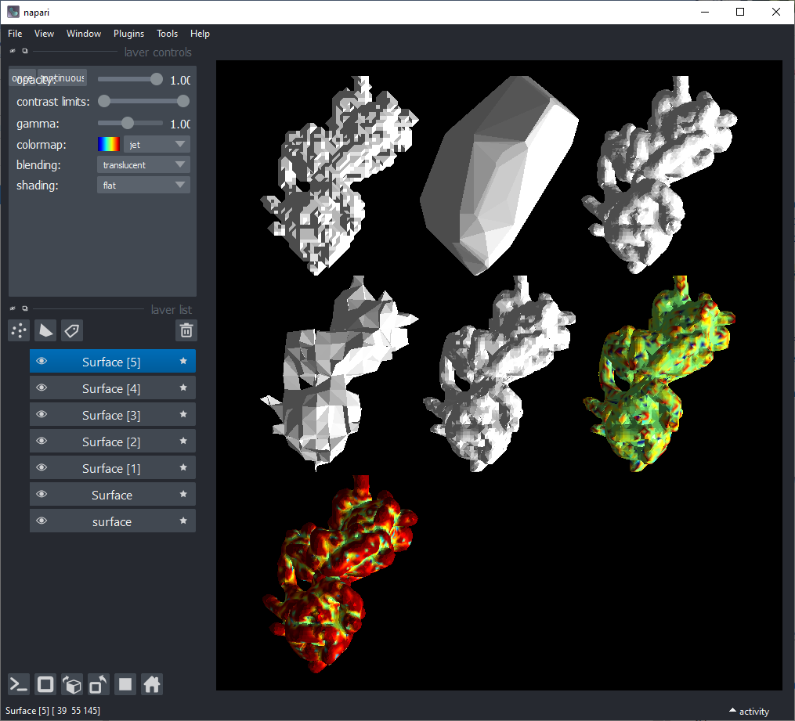

# napari-pymeshlab

Interfaces between `napari` and the `pymeshlab` library to allow import, export, construction and processing of surfaces. 

This is a WIP and feature requests are welcome. Please check [PyMeshLab](https://pymeshlab.readthedocs.io/en/latest/)
for possible features.

## Feature list

- Read/write .3ds, .apts, .asc, .bre, .ctm, .dae, .e57, .es, .fbx, .glb, .gltf, .obj, .off, .pdb, .ply,
                  .ptx, .qobj, .stl, .vmi, .wrl, .x3d, .x3dv
- [Screened Poisson Surface Reconstruction](https://www.cs.jhu.edu/~misha/MyPapers/ToG13.pdf)
- [Convex hull of a surface](https://pymeshlab.readthedocs.io/en/0.1.9/tutorials/apply_filter.html)
- [Laplacian smoothing of surfaces](https://pymeshlab.readthedocs.io/en/0.1.9/filter_list.html#laplacian_smooth)
- [Smoothing surfaces using Taubin's method](https://pymeshlab.readthedocs.io/en/0.1.9/filter_list.html#taubin_smooth)
- [Surface simplification using clustering decimation](https://pymeshlab.readthedocs.io/en/0.1.9/filter_list.html#simplification_clustering_decimation)
- [colorize_curvature_apss](https://pymeshlab.readthedocs.io/en/0.1.9/filter_list.html#colorize_curvature_apss)

Some functions are shown in the [demo notebook](docs/demo.ipynb).

----------------------------------

<!--

This [napari] plugin was generated with [Cookiecutter] using [@napari]'s [cookiecutter-napari-plugin] template.

Don't miss the full getting started guide to set up your new package:
https://github.com/napari/cookiecutter-napari-plugin#getting-started

and review the napari docs for plugin developers:
https://napari.org/plugins/stable/index.html
-->

## Installation 

You can install `napari-pymeshlab` via [pip]:

    pip install napari-pymeshlab

## Contributing

Contributions are very welcome. Tests can be run with [tox], please ensure
the coverage at least stays the same before you submit a pull request.

## License

Distributed under the terms of the [GNU GPL v3.0] license,
"napari-pymeshlab" is free and open source software

## Issues

If you encounter any problems, please [file an issue](https://github.com/zacsimile/napari-pymeshlab/issues) along with a detailed description.

[napari]: https://github.com/napari/napari
[Cookiecutter]: https://github.com/audreyr/cookiecutter
[@napari]: https://github.com/napari
[MIT]: http://opensource.org/licenses/MIT
[BSD-3]: http://opensource.org/licenses/BSD-3-Clause
[GNU GPL v3.0]: http://www.gnu.org/licenses/gpl-3.0.txt
[GNU LGPL v3.0]: http://www.gnu.org/licenses/lgpl-3.0.txt
[Apache Software License 2.0]: http://www.apache.org/licenses/LICENSE-2.0
[Mozilla Public License 2.0]: https://www.mozilla.org/media/MPL/2.0/index.txt
[cookiecutter-napari-plugin]: https://github.com/napari/cookiecutter-napari-plugin

[napari]: https://github.com/napari/napari
[tox]: https://tox.readthedocs.io/en/latest/
[pip]: https://pypi.org/project/pip/
[PyPI]: https://pypi.org/
